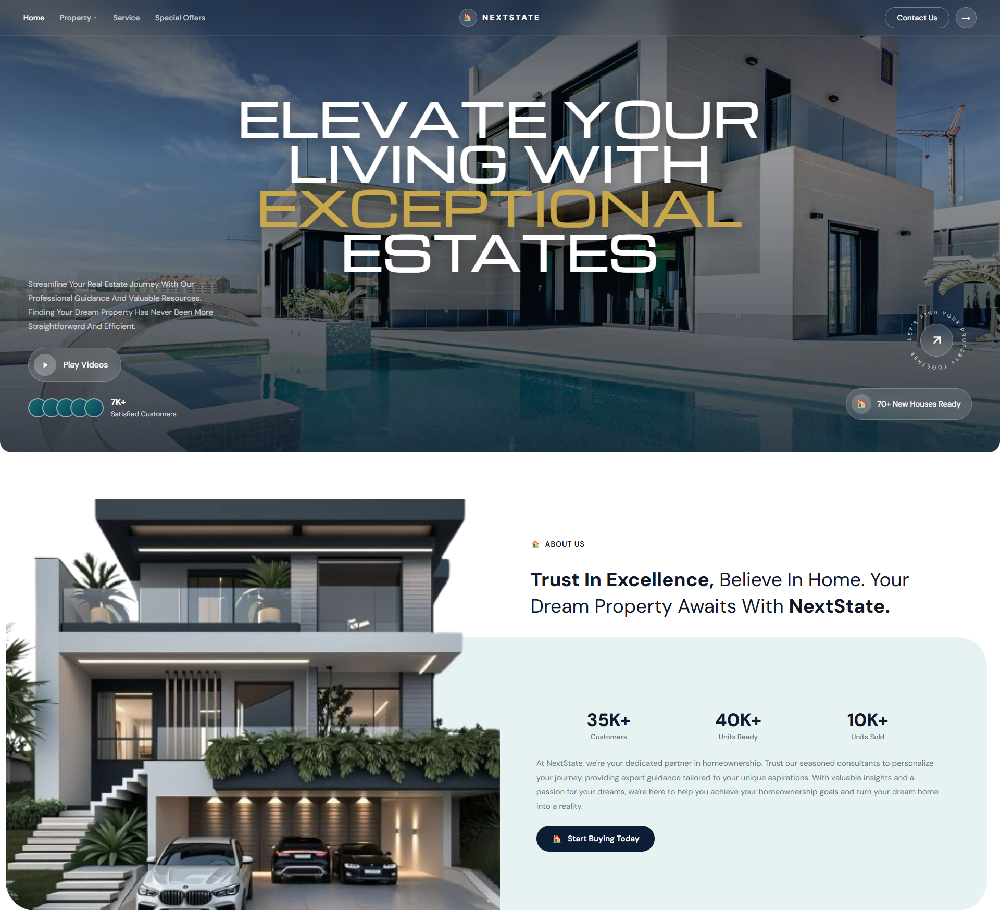
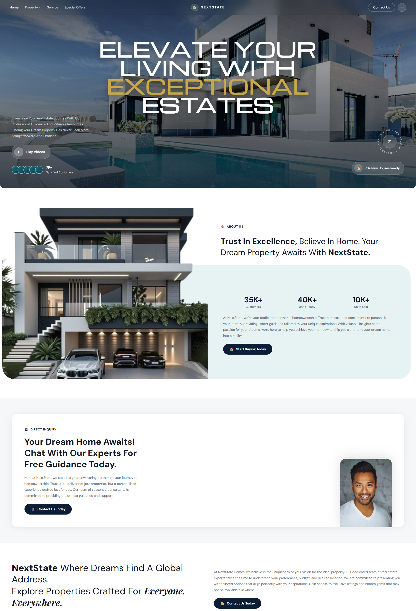
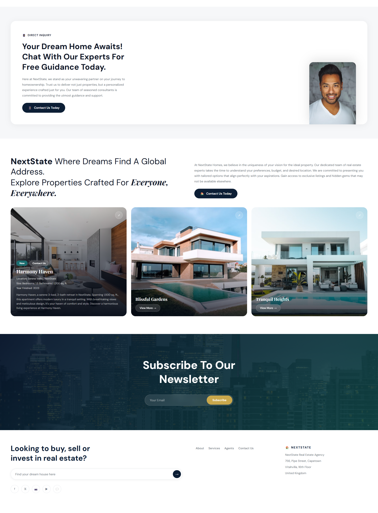
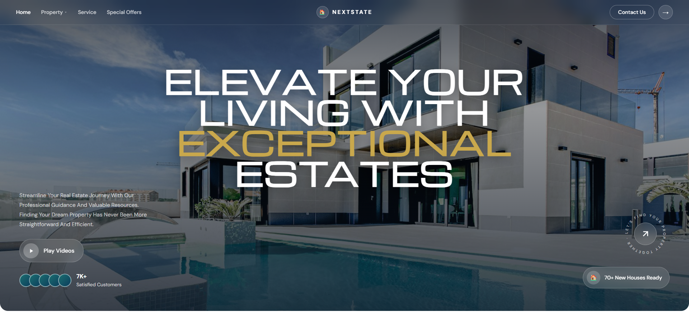

# Nextstate — Real Estate Platform UI


A modern, fully responsive real estate platform UI built
with pure HTML, CSS, and JavaScript. Designed as a
portfolio project showcasing clean UI/UX design, property
listing architecture, and smooth frontend interactions —
no frameworks, no dependencies.

---

## 🌐 Live Demo

> Coming soon — deploy via GitHub Pages or Vercel

---

## 📸 Screenshots

### Hero / Landing


### Property Listings


### Property Detail


### About / Features Section


### About Background


### Mobile / Additional View


---

## ✨ Features

- **Hero Section** — Full-width landing with bold
  headline, property search bar, and strong CTA
- **Property Listings Grid** — Clean card layout
  showcasing properties with image, price, location,
  beds and baths
- **Advanced Search & Filter** — Filter properties
  by location, price range, property type and bedrooms
- **Property Detail Page** — Full property view with
  image gallery, specs, description and enquiry form
- **About / Features Section** — Brand story and
  platform value proposition with background imagery
- **Responsive Design** — Fully optimised for mobile,
  tablet and desktop screens
- **Smooth Animations** — Subtle hover transitions
  and scroll interactions throughout
- **Enquiry / Contact Form** — Built-in contact form
  on property listings
- **Modern Navigation** — Sticky header with smooth
  scroll and mobile-friendly layout

---

## 🛠️ Built With

| Technology | Purpose |
|---|---|
| HTML5 | Semantic page structure |
| CSS3 | Styling, layouts, animations |
| JavaScript (Vanilla) | Interactivity and UI logic |
| CSS Grid & Flexbox | Responsive layout system |
| CSS Custom Properties | Design token system |
| Google Fonts | Typography |

---

## 📁 Project Structurenextstate/
├── index.html            # Main entry point
├── styles/
│   ├── styles.css        # Main stylesheet
│   └── responsive.css    # Mobile/tablet breakpoints
├── scripts/
│   └── main.js           # JavaScript functionality
├── assets/
│   └── images/           # Property and brand images
└── screenshots/
├── nextstate.png
├── nextstate2.png
├── nextstate3.png
├── nextstate4.png
├── nextstate5.png
└── about-bckgrd.png


---

## 🚀 Getting Started

No installation or build step required.

**Option 1 — Open directly:**
```bash
# Clone the repository
git clone https://github.com/JoshuaKvng/nextstate.git

# Open in your browser
open index.html
```

**Option 2 — Live Server (recommended):**
1. Open the project folder in VS Code
2. Install the **Live Server** extension
3. Right-click `index.html` → **Open with Live Server**

---

## 🎨 Design Decisions

**Premium Real Estate Aesthetic** — The design
language is deliberately elevated — think luxury
property brochure translated to web. Clean typography,
generous whitespace, and high-quality property imagery
create immediate trust with high-value buyers.

**Card Architecture** — Each property card delivers
the four key buyer decisions (price, location, beds,
baths) before the user clicks — reducing friction and
increasing enquiry rates.

**Search-First UX** — The hero section leads with a
search bar rather than a passive headline, reflecting
how real estate buyers actually behave — they search
before they browse.

**Background Imagery** — The about section uses full
bleed background photography to create atmosphere and
emotional connection to the brand without overwhelming
the content hierarchy.

**No Framework** — Built intentionally in vanilla
HTML/CSS/JS to demonstrate core frontend fundamentals
and keep the project completely dependency-free.

---

## 📐 Design System

| Token | Value |
|---|---|
| Base Spacing | 8px grid |
| Border Radius | 12px (cards), 999px (pills) |
| Transition | 0.2s ease |
| Mobile Breakpoint | 480px |
| Tablet Breakpoint | 768px |

---

## 🔮 Planned Improvements

- [ ] Google Maps integration for property locations
- [ ] Saved/favourite properties with localStorage
- [ ] Mortgage calculator widget
- [ ] Dark mode toggle
- [ ] Firebase backend for live listing data
- [ ] Scroll animations via Intersection Observer
- [ ] Full Next.js rebuild with CMS integration

---

## 👤 Author

**Joshua Adejola**
Frontend Developer & UI/UX Designer

- Portfolio: [portfolio-prtfl.web.app](https://portfolio-prtfl.web.app)
- LinkedIn: [joshua-adejola-5aa1a8297](https://linkedin.com/in/joshua-adejola-5aa1a8297)
- GitHub: [@JoshuaKvng](https://github.com/JoshuaKvng)
- Fiverr: [Coming soon]

---

## 📄 License

This project is open source and available under
the [MIT License](LICENSE).

---

> Built with 💻 by Joshua Adejola —
> feel free to star ⭐ the repo if you found it useful
